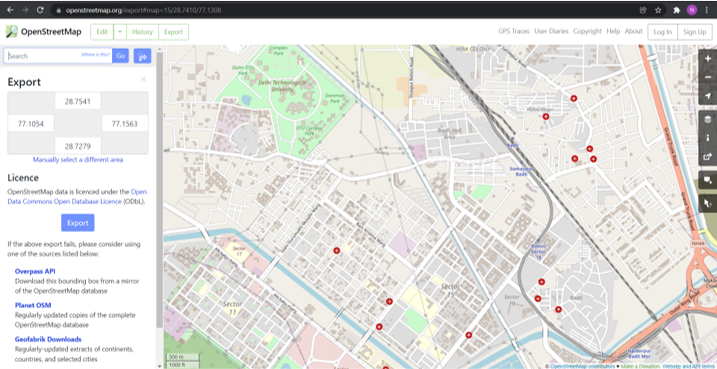
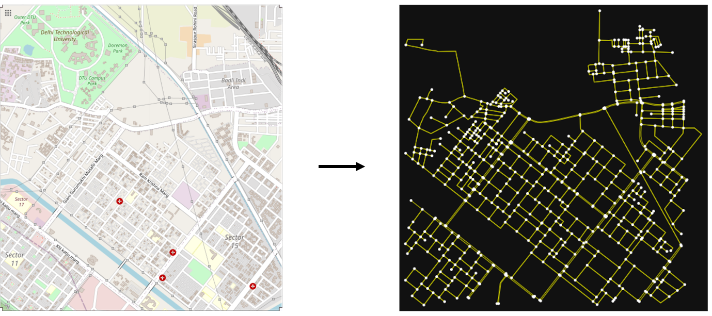
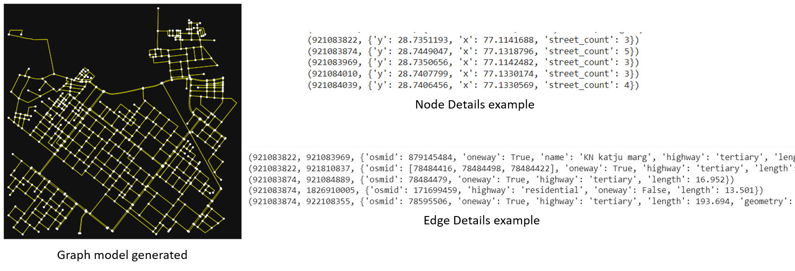
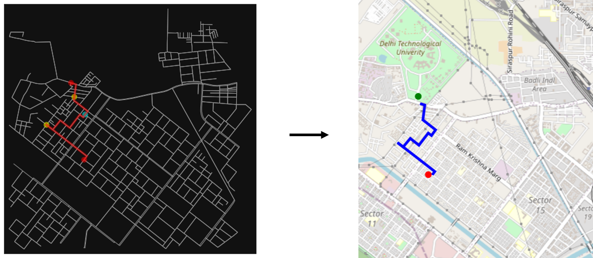
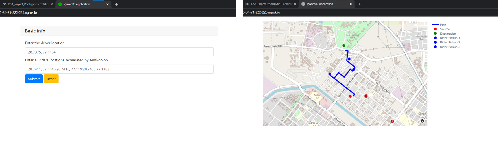

# Campus Pooling using OSM
> A Dijkstra based car-pooling algorithm was designed and implemented on Open Street Maps, where a student picks up other students optimising the distance on its way to campus.

## Introduction
Carpooling is the sharing of car journeys so that more than one person travels in a car. Carpooling reduces each person's travel costs such as: fuel costs, tolls, and the stress of driving, reduces air pollution, traffic congestion on the roads, and the need for parking spaces.
The project is aimed to find the most optimized route between the rider’s location and campus picking up as many as possible people going to campus, minimizing the distance factor. For this, we are getting a small area of map surrounding campus from OSM (Open Street Map) to create our adjacency list. 
OsmNX is used for converting map data to graph data and shortest paths using the Dijkstra’s Algorithm.

## Implementation
### Importing map data
In our project we are considering map around DTU campus, where we used OSM (Open Street Maps) which is a community driven map service provider available free for use. We defined the coordinates for our map required region and the map was imported using osmnx library.

### Generating Graph Object
To make use of path finding algorithms we need to convert our raw map data to a graph. For this, OSMnx, a Python package that lets us use geospatial data from OpenStreetMap and model it into graph objects was used.
The graph objects generated consist of nodes and edges details as given, from which required data were extracted to create the adjacency list.

### Defining naïve pooling algorithm
- The pooling algorithm used in our project takes in input the starting coordinates of our driver, and all the intermediate students coordinates to generate an optimal path to the destination which in our case is DTU campus.
- The algorithm generates a list of all the possible shortest paths that could be taken by the driver, permutating all combination of pickups possible. 
- Dijkstra’s shortest path algorithm is used to calculate the shortest path to the destination node for all the combinations defined.
- Constraints:
-- The maximum number of riders to be picked should be less than or equal to seating capacity of vehicle. For demo purpose we have assumed seating capacity as 3.
-- The maximum distance the driver will be travelling should not exceed 1.5 times its initial no pooling route.

## Results
### Plotting obtained path
The path returned by the algorithm is in the form of list of node ids. These are converted to coordinates using osm map data, after which path is plotted that returns a map object with path.

### User Interface
For demonstration purpose, a web application user interface was created using a python library pywebIO, which is a python library that creates a web application without writing any html code. This allowed us to directly use our functions defined to visualize the project.

